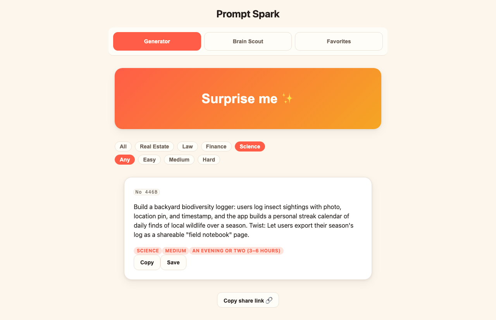

# prompt-spark — overnight build report

**Prompt Spark**: a playful React+Vite+TypeScript SPA that generates fun, well-scoped project prompts across Real Estate / Law / Finance / Science packs (48 curated templates), with a seedable deterministic randomizer, conjunctive filters with time-band tags, copy + localStorage favorites, shareable prompt URLs, and a Brain Scout mode that expands any seed idea into a 4-rung scope ladder plus 3 subject-lens remixes — all client-side, mobile-first.



## Run it

```
cd /Users/truman/Projects/prompt-spark
npm install
npm run dev -- --port 5199 --strictPort
# open http://localhost:5199 — try /?seed=42&subject=science for a shared prompt
```

Tests: `npx vitest run` (117 tests). Production build: `npm run build`.

## Must-haves

| Must-have | Status | Reason / evidence |
|---|---|---|
| Subject packs (≥10/subject, variables) | ✅ shipped | cycle 4-5: 12 templates × 4 packs, `validatePack`=[], all difficulties per pack, conductor-run tests |
| Randomizer / Surprise-me (seedable) | ✅ shipped | cycle 6: cross-process determinism verified (marker-file string equality); cycle 7 look: live card render |
| Difficulty + time tags with filters | ✅ shipped | cycle 6: all 12 subject×difficulty combos exact time-band strings; conjunctive filtering conductor-tested |
| Copy + favorites (localStorage) | ✅ shipped | cycles 6-10: dedupe/remove-one/persistence conductor-tested; live save→favorites→remove roundtrip in cycle 7 look pass |
| Brain Scout (4-rung ladder + 3 remixes) | ✅ shipped | cycles 7-8: verbatim-phrase/order/id-formula conductor-verified in core and in mounted UI |

Nice-to-haves: **share links** ✅ (URL bootstrap verified, cycle 8); **confetti + streak stats** ❌ dropped (clock); **dark mode + Markdown export** ❌ dropped (clock) — dark-mode custom properties already exist in tokens.css, so this is a small follow-up.

## Decisions log

- cycle 1: "Spark Machine" — AMBITIOUS design brief won blind judging 36/40; frozen contract → pure TS core → thin UI; delighters only after must-haves green
- cycle 1: grafted 5 steals from losing briefs (scout-favorite id scheme, seed-as-serial, non-empty combo test, reduced-motion guard, mixed-case verbatim test)
- cycle 6: FilterBar scoped to Generator tab (look finding, folded into T-010)
- cycle 7: KI-1 useFavorites infinite loop confirmed by strict mount test; T-012's workaround accepted, hook fixed cycle 8

## Known issues

- KI-1 (resolved): useFavorites() violated useSyncExternalStore snapshot stability → infinite loop on mount — found cycle 7, fixed + verified cycle 8. FavoritesView still uses its local-subscription workaround (works fine; migrating it back to the fixed hook is optional cleanup).

## Night log

- cycle 1: design panel — 3 briefs, blind judge, winner B "Spark Machine"
- cycle 2: PLAN — 16-item backlog covering all must-haves
- cycle 3: contract freeze merged + verified; look pass clean
- cycle 4: 4 subject packs (48 templates) + share core; 3 verified
- cycle 5: pack registry + 50-test validity suite
- cycle 6: deterministic core + favorites store + app shell; 3 verified
- cycle 7: real generation live + Brain Scout core + favorites view; KI-1 confirmed; 4 look findings filed
- cycle 8: Brain Scout UI + share links + KI-1 fix + punctuation fix — all 5 must-haves verified
- cycle 9: adversarial review — 11 findings, 8 reproduced, 2 fix branches merged, 1 conflicted → requeued
- cycle 10: requeued findings fixed (labels, copy-failure state, scout test)
- cycle 11: action-button styling; wrap-up

## Night control log

_No commands received._

## Stats

| Stat | Value |
|---|---|
| Cycles run | 11 |
| Commits | 49 |
| Agents dispatched | 32 (4 design, 1 plan, 15 builders, 3 look-QA, 7 review-fix, 2 misc) |
| Models used | fable (judgment seats + correctness core), opus (reviewers), sonnet (builders/fixers) |
| Notifications sent | 24 |

## Honest hand-off

**Machine-checked:** 117-test suite green; production build green; determinism verified cross-process by the conductor; every must-have exercised in a real (headless) browser via three look passes with screenshots; all review findings either fixed+re-verified or discarded as unreproducible.

**Not run:** the full 3-agent QA pass (spec-only scenario author → executor → live-look) was skipped for clock — QA evidence is the look passes plus conductor-authored jsdom/browser checks, which are thorough but not independent of the conductor. No accessibility audit beyond aria-pressed tabs. No cross-browser check (Chromium only).

**Only a human can finish:** taste judgment on the prompt content itself (48 templates — read a few, prune any duds); whether Brain Scout's ladder phrasing feels genuinely useful on your phone; the three dropped delighters (confetti/streak, dark mode, Markdown export — all small); optionally migrate FavoritesView back to the fixed useFavorites hook.

---

Repo tagged `v0.1-overnight`. Generated by /swarm WRAP_UP at 2026-08-09T05:05:00-04:00.
